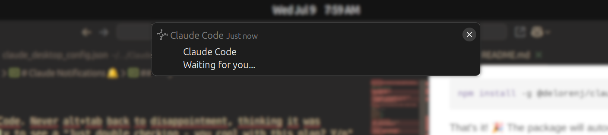

# Claude Notifications 🔔

Delightful audible notifications for Claude Code. Never alt+tab back to disappointment, thinking it was cranking away for 30-minutes on your task only to see a "Just double checking - you cool with this plan? Y/n"



## ⚡ Super Quick Install

```bash
npm install -g @delorenj/claude-notifications
```

That's it! 🎉 The package will automatically:

- ✅ Install the notification system
- 🎼 Generate a delightful notification scale
- 🪝 Configure Claude Code stop hooks
- 🧪 Test the installation

## Features

- 🎵 **Final Fantasy Dream Harp** - Classic C-D-E-G ascending/(optional)descending pattern
- 🔔 **Service Desk Bell** - Optional short, crisp bell sound for a quick "done!" signal
- 🔊 **Cross-Platform Audio** - Works on Linux and macOS
- 🖥️ **Desktop Notifications** - Visual notifications with Claude Code branding (optional)
- 🪝 **Auto-Integration** - Automatically configures Claude Code hooks
- ⚡ **Zero Configuration** - Works out of the box
-  webhook **Webhook Support** - Trigger a webhook in addition to or instead of the sound
- 🎨 **Customizable** - Easy to modify sounds and settings

## Usage

After installation, Claude Code will begin notifying you when it finishes or is waiting on your response.

### Manual Commands

```bash
# Trigger notification manually
claude-notify

# Trigger bell notification manually
claude-notify --bell

# Test the system
claude-notifications test

# Test the bell sound
claude-notifications test-bell

# Reinstall/repair
claude-notifications install

# Get help
claude-notifications help
```

## The Sound

- **Pattern**: C1-D1-E1-G1-C2-D2-E2-G2-C3-G2-E2-D2-C2-G1-E1-D1-C1
- **Duration**: ~2 seconds of dreamy notes

## How It Works

The package automatically:

1. **Detects Claude Code** - Finds your Claude Code configuration
2. **Adds Stop Hook** - Configures the notification trigger
3. **Creates Sound** - Generates the sound using `sox`
4. **Sets Up Commands** - Installs `claude-notify` globally

### Claude Code Integration

The installer automatically adds this to your Claude Code settings:

```json
{
  "hooks": {
    "Stop": [
      {
        "matcher": "",
        "hooks": [
          {
            "type": "command",
            "command": "claude-notify"
          }
        ]
      }
    ]
  }
}
```

## Requirements

- **Node.js** 14+ (you probably have this if you use Claude Code)
- **Linux or macOS** (Windows support coming soon)
- **Audio system** (PulseAudio, ALSA, or CoreAudio)

### Auto-Installed Dependencies

The package will automatically install:

- `sox` for sound generation (Linux: apt/dnf, macOS: brew)
- `node-notifier` for desktop notifications

## Customization

### Change the Sound

Replace the generated sound file:

```bash
# Find the sound file
ls ~/.local/share/sounds/claude-notification.wav

# Replace with your own
cp your-custom-sound.wav ~/.local/share/sounds/claude-notification.wav
```

### Configure Webhooks

You can configure a webhook to be triggered when a notification occurs. This is useful for integrating with other services, such as IFTTT, Zapier, or a custom server.

Create a configuration file at `~/.config/claude-notifications/settings.json`.

**Example `settings.json`:**

```json
{
  "sound": true,
  "soundType": "claude-notification",
  "desktopNotification": false,
  "webhook": {
    "enabled": true,
    "url": "https://maker.ifttt.com/trigger/claude_notification/with/key/YOUR_KEY",
    "replaceSound": false
  }
}
```

**Configuration Options:**

- `sound`: (boolean) Whether to play notification sounds. Defaults to `true`.
- `soundType`: (string) Which sound to play. Available options:
  - `"claude-notification"` - Final Fantasy dream harp (default)
  - `"claude-notification-bell"` - Service desk bell
- `desktopNotification`: (boolean) Whether to show desktop notification banners. Defaults to `false`.
- `webhook.enabled`: (boolean) Whether to trigger the webhook. Defaults to `false`.
- `webhook.url`: (string) The URL to send the POST request to.
- `webhook.replaceSound`: (boolean) If `true`, the sound will not play when a webhook is triggered. Defaults to `false`.

The webhook will be sent as a `POST` request with a JSON payload:

```json
{
  "message": "Claude is waiting for you..."
}
```

### Sound Files

Sound files are stored in `~/.config/claude-notifications/sounds/` and can be customized by replacing the `.wav` files in that directory.

### Create Custom Patterns

Use `sox` to create new victory fanfares:

> Note: Previously, a tedious chore I wouldn't recommend to a sane person. But now that we live in a fictional Blade Runner, Cyberpunk-inspired alternate timeline, just ask your robot buddy to do it!

```bash
# Simple ascending scale
sox -n custom.wav synth 0.1 sine 261.63 : synth 0.1 sine 293.66 : synth 0.1 sine 329.63

# Your imagination is the limit!
```

## Troubleshooting

### No Sound?

```bash
# Test your audio system
paplay /usr/share/sounds/alsa/Front_Left.wav  # Linux
afplay /System/Library/Sounds/Glass.aiff      # macOS

# Reinstall
claude-notifications install
```

### No Notification?

```bash
# Test manually
claude-notify

# Check Claude Code config
claude-notifications install  # Will show config location
```

### Command Not Found?

```bash
# Reinstall globally
npm install -g @delorenj/claude-notifications

# Or use npx
npx @delorenj/claude-notifications test
```

## Uninstall

```bash
npm uninstall -g @delorenj/claude-notifications
```

The uninstaller will clean up sound files and notify you about manual config cleanup.

## Development

### Local Development

```bash
git clone https://github.com/delorenj/claude-notifications.git
cd claude-notifications
npm link
claude-notifications install
```

### Publishing

```bash
npm version patch
npm publish
```

## Contributing

PRs welcome! Especially for:

- Windows support
- More sound patterns
- Better Claude Code detection
- macOS improvements

## License

MIT License - Make it your own! 🎵

---

**Ready to level up your Claude Code experience?**

```bash
npm install -g @delorenj/claude-notifications
```

_Made with ❤️ for fellow developers of the world over.
but mostly for me, who alt-tabs away into the night leaving techno-breadcrumb trails of unanswered and unfinished Claude Code tasks._

🎮✨ **Enjoy!** ✨🎮
