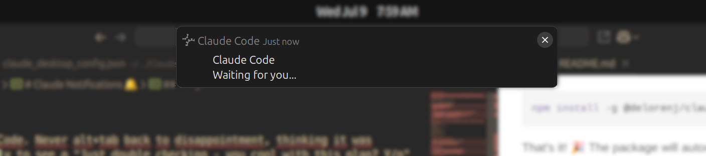

# Claude Notifications 🔔

Delightful audible notifications for Claude Code. Never alt+tab back to disappointment, thinking it was cranking away for 30-minutes on your task only to see a "Just double checking - you cool with this plan? Y/n"



## ⚡ Super Quick Install

```bash
npm install -g @delorenj/claude-notifications
claude-notifications install
```

Step 1 installs the CLI and generates sound assets. Step 2 opens an interactive selector that:

- 🔎 Detects every supported agent CLI on your `$PATH` (Claude Code, Opencode, Gemini, Auggie, Copilot, Kimi, Vibe, Codex)
- ☑️ Lets you toggle which ones should receive notification hooks
- 🪝 Writes a marker-tagged hook block into each selected CLI's config (idempotent — re-running is safe)
- 🚫 Shows unsupported CLIs disabled with a reason rather than silently skipping them

Hook installation no longer runs automatically on `npm install` — it's an explicit, opt-in step so you stay in control of what gets written to your agent configs.

## Features

- 🎵 **Final Fantasy Dream Harp** - Classic C-D-E-G ascending/(optional)descending pattern
- 🔔 **Service Desk Bell** - Optional short, crisp bell sound for a quick "done!" signal
- 🔊 **Cross-Platform Audio** - Works on Linux and macOS
- 🖥️ **Desktop Notifications** - Visual notifications with Claude Code branding (optional)
- 🪝 **Auto-Integration** - Automatically configures Claude Code hooks
- ⚡ **Zero Configuration** - Works out of the box
- 🎨 **Customizable** - Easy to modify sounds and settings

## Usage

After installation, Claude Code and OpenCode can notify you when they finish or
need your response.

### Manual Commands

```bash
# Interactive hook installer (TUI)
claude-notifications install

# Scripted install for specific CLIs (skips the TUI)
claude-notifications install --non-interactive --cli=claude-code,opencode

# Preview changes without writing
claude-notifications install --dry-run --cli=opencode

# Show which CLIs are detected and whether hooks are installed
claude-notifications status
claude-notifications status --json

# Cleanly remove everything this package installed
claude-notifications uninstall

# Regenerate sound assets only
claude-notifications sounds

# Trigger notification manually
claude-notify
claude-notify --bell

# Test the system
claude-notifications test
claude-notifications test-bell

# Full flag reference
claude-notifications help
```

### Adding support for another agent CLI

Each supported CLI is a module under `lib/adapters/<id>.js` exporting this shape:

```js
{
  id, label, binary, supportsHooks,
  detect(deps), configPath(), install(ctx), uninstall(ctx), status(ctx)
}
```

To add a new adapter:

1. Copy `lib/adapters/claude-code.js` as a starting point (for hook-capable CLIs)
   or `lib/adapters/_stub.js::createStubAdapter({...})` (for CLIs whose hook API
   you haven't verified yet).
2. Implement `install` / `uninstall` with the shared marker protocol. Use
   `upsertByMarker` / `removeByMarker` for array-shaped config entries, or
   embed `source: "claude-notifications"` in managed files so the entry is
   idempotent and cleanly removable.
3. Register the module by appending a `require()` line to the `adapterFactories`
   array in `lib/adapters/index.js`.
4. Add a test under `test/adapters/<id>.test.js` following the pattern in
   `test/adapters/claude-code.test.js`.

The TUI and status commands pick up the new adapter automatically.

## The Sound

- **Pattern**: C1-D1-E1-G1-C2-D2-E2-G2-C3-G2-E2-D2-C2-G1-E1-D1-C1
- **Duration**: ~2 seconds of dreamy notes

## How It Works

The package automatically:

1. **Detects supported CLIs** - Finds Claude Code, OpenCode, and other agent CLIs
2. **Adds hooks** - Configures the notification trigger for each supported CLI
3. **Creates Sound** - Generates the sound using `sox`
4. **Sets Up Commands** - Installs `claude-notify` globally

### Claude Code Integration

The installer automatically adds this to your Claude Code settings:

```json
{
  "hooks": {
    "Stop": [
      {
        "matcher": "",
        "hooks": [
          {
            "type": "command",
            "command": "claude-notify"
          }
        ]
      }
    ]
  }
}
```

### OpenCode Integration

The installer writes a managed global plugin at
`~/.config/opencode/plugins/claude-notifications.js`. The plugin listens for
OpenCode session and permission events, then runs `claude-notify`:

```js
export const ClaudeNotifications = async () => ({
  event: async ({ event }) => {
    if (event && EVENT_TYPES.has(event.type)) runNotification();
  },
});
```

Uninstall removes this plugin only when it contains the
`claude-notifications` marker. Existing plugin files without that marker are
left untouched.

## Requirements

- **Node.js** 14+ (you probably have this if you use Claude Code)
- **Linux or macOS** (Windows support coming soon)
- **Audio system** (PulseAudio, ALSA, or CoreAudio)

### Auto-Installed Dependencies

The package will automatically install:

- `sox` for sound generation (Linux: apt/dnf, macOS: brew)
- `node-notifier` for desktop notifications

## Customization

### Change the Sound

Replace the generated sound file:

```bash
# Find the sound file
ls ~/.local/share/sounds/claude-notification.wav

# Replace with your own
cp your-custom-sound.wav ~/.local/share/sounds/claude-notification.wav
```

### Configuration

Create a configuration file at `~/.config/claude-notifications/settings.json` to customize behavior.

**Example `settings.json`:**

```json
{
  "sound": true,
  "soundType": "claude-notification",
  "desktopNotification": false
}
```

**Configuration Options:**

- `sound`: (boolean) Whether to play notification sounds. Defaults to `true`.
- `soundType`: (string) Which sound to play. Available options:
  - `"claude-notification"` - Final Fantasy dream harp (default)
  - `"claude-notification-bell"` - Service desk bell
- `desktopNotification`: (boolean) Whether to show desktop notification banners. Defaults to `false`.

### Sound Files

Sound files are stored in `~/.config/claude-notifications/sounds/` and can be customized by replacing the `.wav` files in that directory.

### Create Custom Patterns

Use `sox` to create new victory fanfares:

> Note: Previously, a tedious chore I wouldn't recommend to a sane person. But now that we live in a fictional Blade Runner, Cyberpunk-inspired alternate timeline, just ask your robot buddy to do it!

```bash
# Simple ascending scale
sox -n custom.wav synth 0.1 sine 261.63 : synth 0.1 sine 293.66 : synth 0.1 sine 329.63

# Your imagination is the limit!
```

## Troubleshooting

### No Sound?

```bash
# Test your audio system
paplay /usr/share/sounds/alsa/Front_Left.wav  # Linux
afplay /System/Library/Sounds/Glass.aiff      # macOS

# Reinstall
claude-notifications install
```

### No Notification?

```bash
# Test manually
claude-notify

# Check Claude Code config
claude-notifications install  # Will show config location
```

### Command Not Found?

```bash
# Reinstall globally
npm install -g @delorenj/claude-notifications

# Or use npx
npx @delorenj/claude-notifications test
```

## Uninstall

```bash
npm uninstall -g @delorenj/claude-notifications
```

The uninstaller will clean up sound files and notify you about manual config cleanup.

## Development

### Local Development

```bash
git clone https://github.com/delorenj/claude-notifications.git
cd claude-notifications
npm link
claude-notifications install
```

### Publishing

```bash
npm version patch
npm publish
```

## Contributing

PRs welcome! Especially for:

- Windows support
- More sound patterns
- Better Claude Code detection
- macOS improvements

## License

MIT License - Make it your own! 🎵

---

**Ready to level up your Claude Code experience?**

```bash
npm install -g @delorenj/claude-notifications
```

_Made with ❤️ for fellow developers of the world over.
but mostly for me, who alt-tabs away into the night leaving techno-breadcrumb trails of unanswered and unfinished Claude Code tasks._

🎮✨ **Enjoy!** ✨🎮
